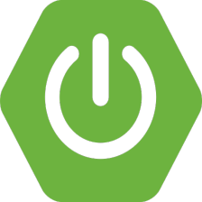

## 技术栈

<table>
    <tr>
      <td align="center" width="96">
        
         Java
      </td>
      <td align="center" width="96">
        
         Mysql
      </td>
      <td align="center" width="96">
        
         Spring
      </td>
      <td align="center" width="96">
        
         SpringBoot
      </td>
      <td align="center" width="96">
        
         Cloud
      </td>
    </tr>
    <tr>
        <td align="center" width="96">
            
             redis
        </td>
        <td align="center" width="96">
            
             RocketMQ
        </td>
        <td align="center" width="96">
            
             RocketMQ
        </td>
        <td align="center" width="96">
            
             RocketMQ
        </td>
    </tr>
  </table>

## Github统计【Github Stats】
<a href="https://github.com/youthlql">
  

## 个人项目【Personal Project】
<a href="https://github.com/youthlql/JavaYouth">
  
